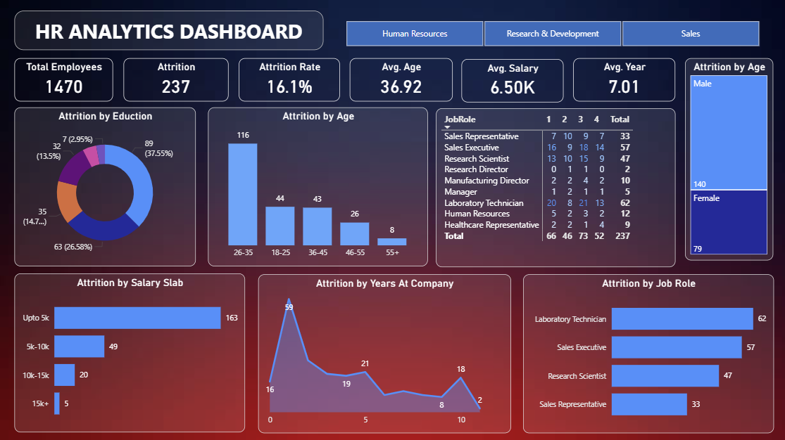

# HR Analytics Dashboard (Power BI)

## 📌 Project Overview
This project focuses on analyzing employee data to understand attrition trends and workforce insights using Power BI.

## 🎯 Objectives
- Analyze employee attrition rate
- Identify attrition by age, salary, education, and job role
- Provide insights for HR decision-making

## 📊 Key Insights
- Highest attrition observed in age group 26–35
- Employees earning up to 5K show maximum attrition
- Laboratory Technician and Sales roles have higher attrition
- Male attrition is higher compared to female

## 🛠 Tools Used
- Power BI
- Microsoft Excel / CSV
- Data Modeling & DAX

## 📁 Files Included
- `HR Analytics Dashboard.pbix` – Power BI report
- `HR_Analytics.csv` – Dataset
- Dashboard Screenshot

## 📷 Dashboard Preview

